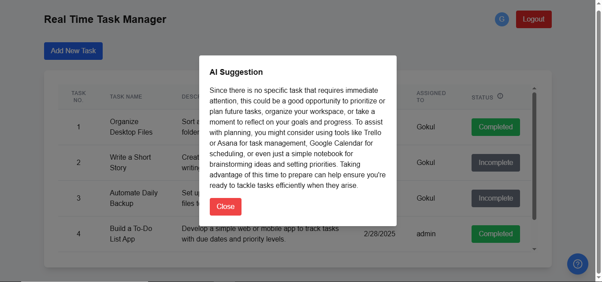

# Real Time Task Management

The Real Time Task Manager is a full-stack web application designed to help teams manage their tasks efficiently. It includes a **frontend** built with [Next.js](https://nextjs.org) and a **backend** built with [Gin](https://gin-gonic.com/) and [MongoDB](https://www.mongodb.com/).

## Overview

This application allows users to create, assign, and track tasks in real-time. It also integrates AI-powered suggestions to provide insights and recommendations for task progress.

### Features

- **User Authentication**: Secure login and logout functionality.
- **Task Management**: Create, update, and delete tasks with ease.
- **Real-Time Updates**: View task status and updates in real-time.
- **AI Suggestions**: Get AI-powered insights for task progress.
- **Responsive Design**: Fully responsive UI for desktop and mobile devices.

## Screenshot

### Website Interface


### AI Suggestions


## Project Structure

The project is divided into two main parts:

1. **Frontend**: Located in the `frontend` folder, built with Next.js.
2. **Backend**: Located in the `backend` folder, built with Gin and MongoDB.

## Getting Started

### Prerequisites

- Node.js (v16 or later)
- npm or yarn
- MongoDB (local or cloud instance)

### Setup

1. Clone the repository:

   ```bash
   git clone https://github.com/your-repo/real-time-task-manager.git
   cd real-time-task-manager
   ```

2. Install dependencies for both frontend and backend:

   ```bash
   cd frontend
   npm install
   cd ../backend
   go mod tidy
   ```

3. Configure environment variables for both frontend and backend. Refer to the respective `README.md` files in the `frontend` and `backend` folders for details.

4. Start the backend server:

   ```bash
   cd backend
   go run main.go
   ```

5. Start the frontend development server:

   ```bash
   cd frontend
   npm run dev
   ```

6. Open [http://localhost:3000](http://localhost:3000) in your browser to access the application.

## Learn More

To learn more about the technologies used in this project, check out the following resources:

- [Next.js Documentation](https://nextjs.org/docs)
- [Gin Documentation](https://gin-gonic.com/docs/)
- [MongoDB Documentation](https://www.mongodb.com/docs/)

## Contributing

Contributions are welcome! Please fork the repository and submit a pull request with your changes.
